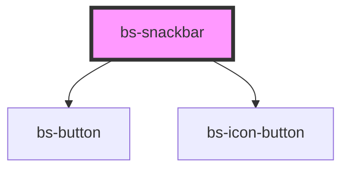

# bs-snackbar

<!-- Auto Generated Below -->

## Overview

A transient status bar for confirming the result of an action (e.g. "Files uploaded
successfully.") -- an icon (or loading spinner), a message, an optional action, and a close
button.

This component only renders the bar itself -- it doesn't manage its own visibility, timing, or
stacking. A consumer (typically a small "toast manager" utility) creates one per message and
removes it from the DOM again, whether on a timer or on `bsDismiss`. Figma's spec doesn't show
auto-dismiss timing at all (it's a static visual spec), so this deliberately doesn't invent one.

The icon is always the same checkmark glyph across every `variant`, just recolored -- matching
the Figma spec exactly, even though a checkmark for `variant="error"` reads a little oddly
semantically. Worth revisiting with severity-specific icons (warning triangle, error circle,
etc.) if the design updates to specify them.

## When to use
- Confirming the outcome of an action that just happened (save succeeded, upload failed) without
  interrupting the user's flow.

## When not to use
- For a response that requires the user to make a decision before continuing -- use `bs-dialog`.
- For persistent, always-visible status -- a snackbar is inherently transient.

## Properties

| Property      | Attribute      | Description                                                                                                                                                                            | Type                                                       | Default     |
| ------------- | -------------- | -------------------------------------------------------------------------------------------------------------------------------------------------------------------------------------- | ---------------------------------------------------------- | ----------- |
| `actionLabel` | `action-label` | Label for the optional action button (e.g. "Undo", "Retry"). Omit this prop entirely to render no action button at all -- its presence, not a boolean flag, is what shows it.          | `string`                                                   | `undefined` |
| `loading`     | `loading`      | Replaces the checkmark icon with a spinning loading indicator, for a message describing in-progress work (e.g. "Uploading files...") rather than a completed result.                   | `boolean`                                                  | `false`     |
| `variant`     | `variant`      | Color/semantic variant. `default` is the neutral (dark, inverse-surface) bar Figma shows as the baseline; `info`/`warning`/`success`/`error` use their matching container/text tokens. | `"default" \| "error" \| "info" \| "success" \| "warning"` | `'default'` |

## Events

| Event       | Description                                                                                                                                                              | Type                |
| ----------- | ------------------------------------------------------------------------------------------------------------------------------------------------------------------------ | ------------------- |
| `bsAction`  | Fires when the action button is clicked. Ignored/never fires if `actionLabel` isn't set.                                                                                 | `CustomEvent<void>` |
| `bsDismiss` | Fires when the close button is clicked. This component doesn't remove itself from the DOM -- the consumer is expected to do that (or hide it) in response to this event. | `CustomEvent<void>` |

## Slots

| Slot | Description                     |
| ---- | ------------------------------- |
|      | Default slot: the message text. |

## Shadow Parts

| Part          | Description                                                           |
| ------------- | --------------------------------------------------------------------- |
| `"action"`    | The optional action button (only rendered when `actionLabel` is set). |
| `"close"`     | The close button.                                                     |
| `"container"` | The outer bar.                                                        |
| `"icon"`      | The leading icon/spinner wrapper.                                     |
| `"message"`   | The message text wrapper.                                             |

## CSS Custom Properties

| Name                              | Description                                                                                                                                                                                                                                                                                                                                 |
| --------------------------------- | ------------------------------------------------------------------------------------------------------------------------------------------------------------------------------------------------------------------------------------------------------------------------------------------------------------------------------------------- |
| `--bs-snackbar-actions-gap`       | Gap between the action button and the close button. Aliased to --bs-spacing-50.                                                                                                                                                                                                                                                             |
| `--bs-snackbar-actions-padding-x` | Right padding of the actions area (the bar's own right edge). Aliased to --bs-spacing-100.                                                                                                                                                                                                                                                  |
| `--bs-snackbar-actions-padding-y` | Top/bottom padding of the actions area. Aliased to --bs-spacing-50.                                                                                                                                                                                                                                                                         |
| `--bs-snackbar-color-default`     | Icon/message/close color, variant="default". Aliased to --bs-snackbar-text-default (brandsync-tokens) -- named "-color-", not "-text-", solely to avoid colliding with that vendored token's own name.                                                                                                                                      |
| `--bs-snackbar-content-gap`       | Gap between the icon and the message. Aliased to --bs-spacing-150.                                                                                                                                                                                                                                                                          |
| `--bs-snackbar-content-padding-x` | Left padding of the content area (the bar's own left edge). Aliased to --bs-spacing-200.                                                                                                                                                                                                                                                    |
| `--bs-snackbar-content-padding-y` | Top/bottom padding of the content area. Aliased to --bs-spacing-200.                                                                                                                                                                                                                                                                        |
| `--bs-snackbar-font-size`         | Message font size. Aliased to --bs-font-size-md.                                                                                                                                                                                                                                                                                            |
| `--bs-snackbar-gap`               | Gap between the content area and the actions area. Aliased to --bs-spacing-100.                                                                                                                                                                                                                                                             |
| `--bs-snackbar-line-height`       | Message line height. Aliased to --bs-line-height-body-md.                                                                                                                                                                                                                                                                                   |
| `--bs-snackbar-radius`            | Corner radius of the bar. Aliased to --bs-border-radius-100.                                                                                                                                                                                                                                                                                |
| `--bs-snackbar-shadow`            | Elevation shadow, since a snackbar floats above page content. Aliased to --bs-shadow-md.                                                                                                                                                                                                                                                    |
| `--bs-snackbar-spinner-track`     | Loading spinner's background ring. Aliased to --bs-neutral-200. The action/close buttons are composed from bs-button/bs-icon-button (see bs-snackbar.tsx) -- their own fill colors, hover/pressed states, and focus rings are governed by THOSE components' own custom properties (--bs-button-*, --bs-icon-button-*), not duplicated here. |
| `--bs-snackbar-surface-default`   | Bar background, variant="default". Aliased to --bs-snackbar-bg-default (brandsync-tokens).                                                                                                                                                                                                                                                  |
| `--bs-snackbar-surface-error`     | Bar background, variant="error". Aliased to --bs-color-error-container.                                                                                                                                                                                                                                                                     |
| `--bs-snackbar-surface-info`      | Bar background, variant="info". Aliased to --bs-color-info-container.                                                                                                                                                                                                                                                                       |
| `--bs-snackbar-surface-success`   | Bar background, variant="success". Aliased to --bs-color-success-container.                                                                                                                                                                                                                                                                 |
| `--bs-snackbar-surface-warning`   | Bar background, variant="warning". Aliased to --bs-color-warning-container.                                                                                                                                                                                                                                                                 |
| `--bs-snackbar-text-error`        | Icon/message/close color, variant="error". Aliased to --bs-text-error.                                                                                                                                                                                                                                                                      |
| `--bs-snackbar-text-info`         | Icon/message/close color, variant="info". Aliased to --bs-text-info.                                                                                                                                                                                                                                                                        |
| `--bs-snackbar-text-success`      | Icon/message/close color, variant="success". Aliased to --bs-text-success.                                                                                                                                                                                                                                                                  |
| `--bs-snackbar-text-warning`      | Icon/message/close color, variant="warning". Aliased to --bs-text-warning.                                                                                                                                                                                                                                                                  |

## Dependencies

### Depends on

- [bs-button](../bs-button/bs-button)
- [bs-icon-button](../bs-button/bs-icon-button)

### Graph

----------------------------------------------

*Built with [StencilJS](https://stenciljs.com/)*
